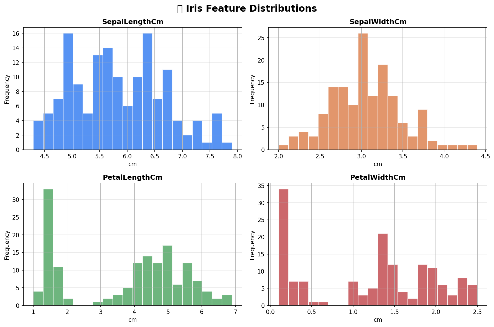
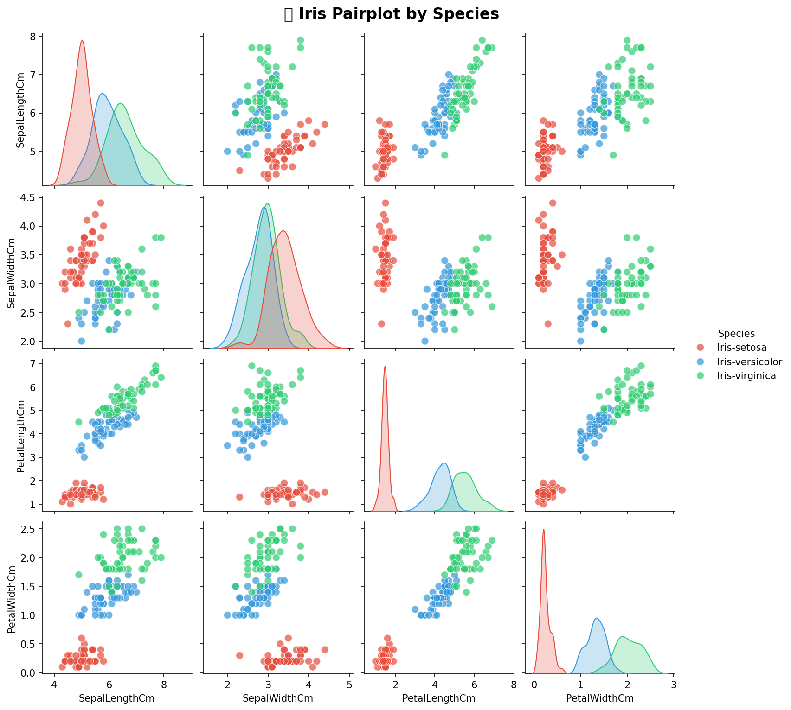
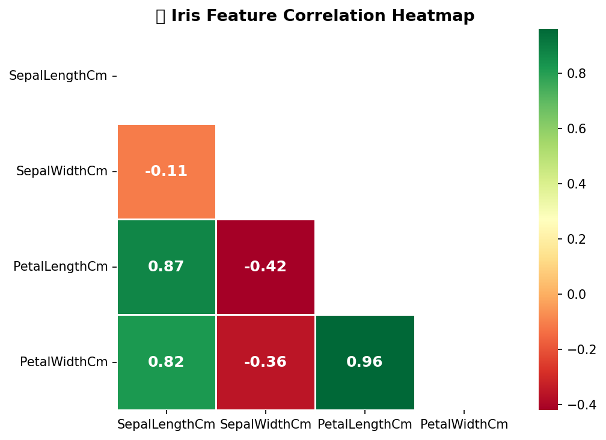
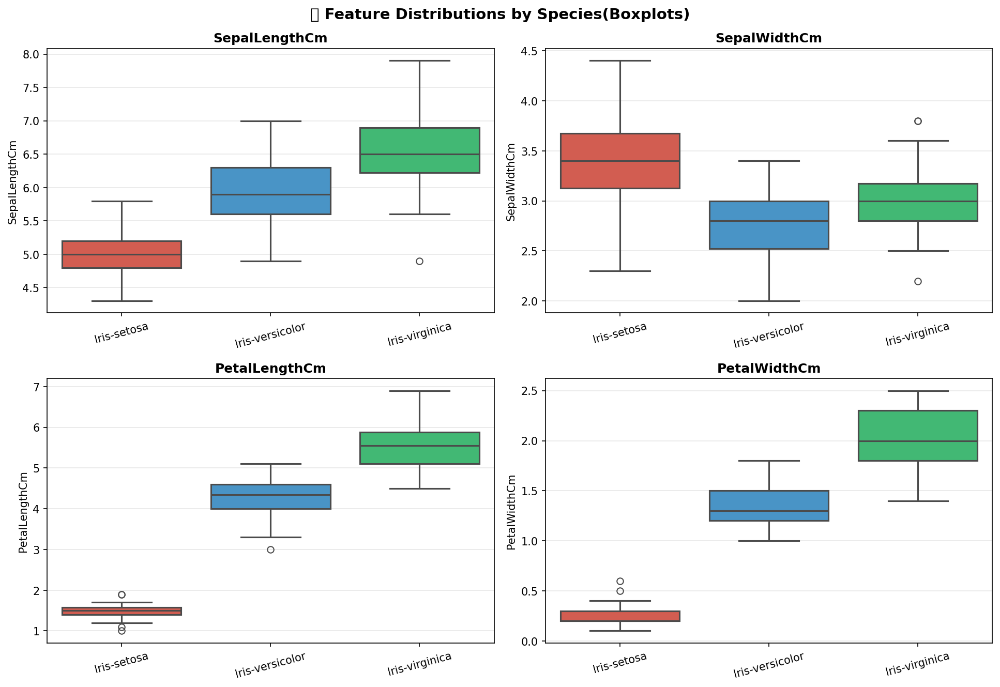
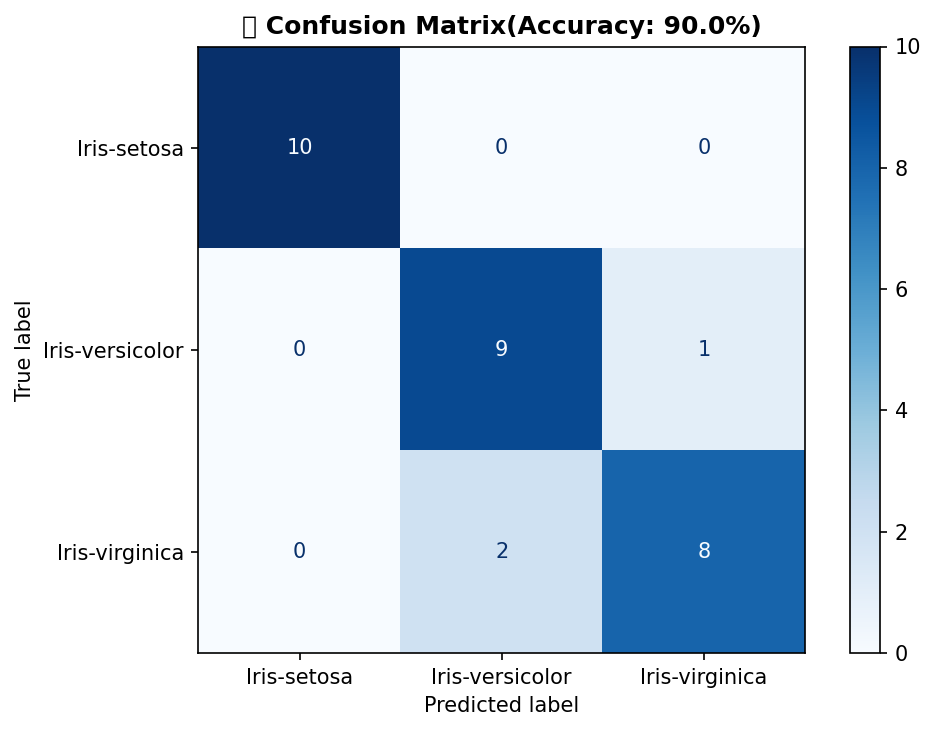
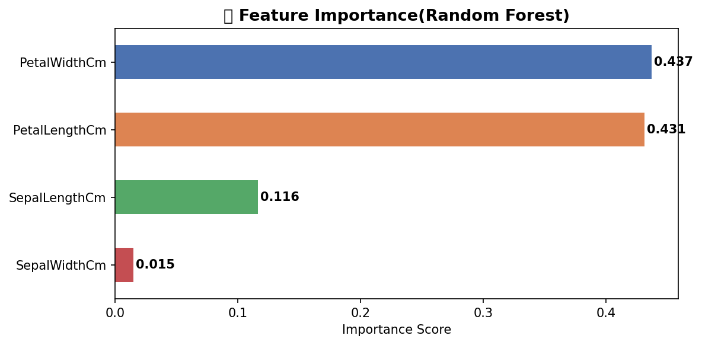

# 🌸 Iris Flower Classification

> End-to-end **Exploratory Data Analysis (EDA)** + **Machine Learning Classification** on the classic Iris dataset.  
> Built with Python · Pandas · Seaborn · Scikit-Learn

---

## 📁 Repository Structure

```
CodeAlpha_Iris-Flower-Classification/
│
├── Iris.csv                          # Dataset (150 rows × 6 cols)
├── task1_iris.py                     # Full EDA + ML pipeline
│
├── Iris_Feature_Distributions.png    # Histogram of all 4 features
├── Iris_Pairplot.png                 # Pairplot coloured by species
├── Iris_Correlation_Heatmap.png      # Feature correlation heatmap
├── Iris_Boxplots.png                 # Boxplots per feature per species
├── Iris_Confusion_Matrix.png         # Model confusion matrix
├── Iris_Feature_Importance.png       # Random Forest feature importances
│
└── README.md
```

---

## 📊 Dataset Overview

| Property        | Value                                      |
|-----------------|--------------------------------------------|
| **Source**      | UCI Machine Learning Repository            |
| **Rows**        | 150                                        |
| **Columns**     | 6 (Id, SepalLengthCm, SepalWidthCm, PetalLengthCm, PetalWidthCm, Species) |
| **Classes**     | 3 — *Iris-setosa*, *Iris-versicolor*, *Iris-virginica* |
| **Class balance** | 50 samples per class (perfectly balanced) |
| **Missing values** | None                                  |
| **Duplicates**  | None                                       |

### Feature Statistics

| Feature          | Min  | Max  | Mean | Std  |
|------------------|------|------|------|------|
| SepalLengthCm    | 4.30 | 7.90 | 5.84 | 0.83 |
| SepalWidthCm     | 2.00 | 4.40 | 3.05 | 0.43 |
| PetalLengthCm    | 1.00 | 6.90 | 3.76 | 1.76 |
| PetalWidthCm     | 0.10 | 2.50 | 1.20 | 0.76 |

---

## 🔍 Exploratory Data Analysis (EDA)

### 1. Feature Distributions


> Petal features (Length & Width) show **bimodal distributions**, clearly separating *Iris-setosa* from the other two species.

---

### 2. Pairplot by Species


> *Iris-setosa* (🔴) is **perfectly linearly separable** from the other two species across all feature pairs. *Versicolor* and *Virginica* show slight overlap.

---

### 3. Feature Correlation Heatmap


> **PetalLengthCm ↔ PetalWidthCm** have the strongest positive correlation (**r = 0.96**).  
> SepalWidthCm has a weak negative correlation with the petal features.

---

### 4. Boxplots by Species


> PetalLengthCm and PetalWidthCm show the **clearest separation** between species, with minimal overlap. These are the most discriminative features.

---

## 🤖 Machine Learning — Random Forest Classifier

### Model Configuration

| Parameter        | Value              |
|------------------|--------------------|
| Algorithm        | Random Forest      |
| n_estimators     | 100                |
| Train / Test     | 80% / 20%          |
| Stratified split | ✅ Yes             |
| random_state     | 42                 |

### Results

| Metric           | Score              |
|------------------|--------------------|
| **Accuracy**     | **90.00%**         |
| Macro Avg Precision | 0.90            |
| Macro Avg Recall    | 0.90            |
| Macro Avg F1-Score  | 0.90            |

### Classification Report

| Class              | Precision | Recall | F1-Score | Support |
|--------------------|-----------|--------|----------|---------|
| Iris-setosa        | 1.00      | 1.00   | 1.00     | 10      |
| Iris-versicolor    | 0.82      | 0.90   | 0.86     | 10      |
| Iris-virginica     | 0.89      | 0.80   | 0.84     | 10      |

### Confusion Matrix


> *Iris-setosa* classified with **100% accuracy**. Minor confusion exists between *versicolor* and *virginica*, consistent with their feature overlap seen in EDA.

---

### Feature Importance


> **PetalWidthCm** and **PetalLengthCm** are the most important features for classification, confirming the EDA findings. Sepal features contribute less to the model's decisions.

---

## 💡 Key Insights

- ✅ **Iris-setosa** is perfectly linearly separable from the other two species
- 📐 **Petal dimensions** (Length + Width) are the most discriminative features (combined importance > 85%)
- 🔗 PetalLengthCm and PetalWidthCm are highly correlated (r = 0.96)
- ⚠️ *Versicolor* and *Virginica* share overlapping feature ranges — a common challenge for this dataset
- 🎯 Random Forest achieves **90% accuracy** on the test set with zero hyperparameter tuning

---

## 🚀 How to Run

### 1. Clone the Repository
```bash
git clone https://github.com/divyanA615-web/CodeAlpha_Iris-Flower-Classification.git
cd CodeAlpha_Iris-Flower-Classification
```

### 2. Install Dependencies
```bash
pip install pandas numpy matplotlib seaborn scikit-learn
```

### 3. Run the Analysis
```bash
python task1_iris.py
```

### 4. Output
All 6 charts will be saved as `.png` files in the current directory, and the ML results will be printed in the terminal.

---

## 🛠️ Technologies Used

| Tool            | Purpose                          |
|-----------------|----------------------------------|
| Python 3.x      | Core language                    |
| Pandas          | Data loading & manipulation      |
| NumPy           | Numerical computation            |
| Matplotlib      | Chart rendering                  |
| Seaborn         | Statistical visualizations       |
| Scikit-Learn    | ML model, metrics, preprocessing |

---

## 📌 Dataset Source

- **UCI Machine Learning Repository** — Iris Dataset  
- [https://archive.ics.uci.edu/ml/datasets/iris](https://archive.ics.uci.edu/ml/datasets/iris)  
- Originally introduced by **Ronald A. Fisher (1936)**

---

## 👤 Author

**DivyanA615-web**  
GitHub: [github.com/divyanA615-web](https://github.com/divyanA615-web)

---

*⭐ If you found this useful, please star the repository!*
